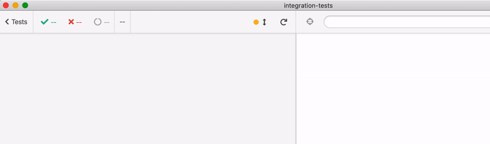

# integration-tests

Example forked from [sarahatwork/integration-tests](https://github.com/sarahatwork/integration-tests) described in [React Integration Testing: Greater Coverage, Fewer Tests](https://css-tricks.com/react-integration-testing-greater-coverage-fewer-tests/) that shows component testing using Cypress and [cypress-react-unit-test](https://github.com/bahmutov/cypress-react-unit-test).

Read [My Vision for Component Tests in Cypress](https://glebbahmutov.com/blog/my-vision-for-component-tests/)


All Cypress specs are in `src/**/*cy-spec.js` and follow Jest + RTL unit tests. But after `mount(...)` they become full web applications and you can interact with the test via standard Cypress commands.



```js
// src/LoginModule/index.cy-spec.js
mount(<LoginModule />);

// it renders empty email and password fields
cy.get('input#email').should('have.value', '')
cy.get('input#password').should('have.value', '')

// it renders enabled submit button
cy.contains('button', 'Submit').should('be.enabled')
```

Jest + RTL | Cypress | Description
--- | --- | ---
[useLogin.unit.test.js](src/hooks/useLogin.unit.test.js) | [useLogin.cy-spec.js](src/hooks/useLogin.cy-spec.js) | Testing React Hook
[Login.unit.test.js](src/LoginModule/components/Login.unit.test.js) | [Login.cy-spec.js](src/LoginModule/components/Login.cy-spec.js) | Testing `<Login>` component
[LoginForm.unit.test.js](src/LoginModule/components/LoginForm.unit.test.js) | [LoginForm.cy-spec.js](src/LoginModule/components/LoginForm.cy-spec.js) | Testing `<LoginForm>` component
[index.unit.test.js](src/LoginModule/index.unit.test.js) | - | See "Note 1" below
[index.integration.test.js](src/LoginModule/index.integration.test.js) | [index.cy-spec.js](src/LoginModule/index.cy-spec.js) | Top level component test
<i>-</i> | [cy-spec.js](cypress/integration/cy-spec.js) | Full end-to-end Cypress test against `localhost:3000`

**Bonus:** the `LoginModule` tests can be executed as a full end-to-end test, see [cypress/integration/cy-spec.js](cypress/integration/cy-spec.js). Just use `cy.visit` instead of `mount`, but the rest stays the same:


**Bonus 2:** component tests using `cypress-react-unit-test` collect code coverage by default. For E2E test we instrument the application on the fly using `@cypress/instrument-cra`, see [How to instrument react-scripts web application for code coverage](https://youtu.be/edgeQZ8UpD0).

A single E2E test covers 100% of the source code. Component tests together also cover 100% of the code.


**Bonus 3:** if you like `testing-library/react`, there is [testing-library/cypress](https://testing-library.com/docs/cypress-testing-library/intro) that you can use in both component and e2e tests

**Note 1:** there is a Jest test that uses a snapshot. While there are Cypress [snapshot plugins](https://on.cypress.io/plugins), I would rather use [Visual testing](https://on.cypress.io/plugins#visual-testing). All Cypress plugins should work in both E2E and component tests.

